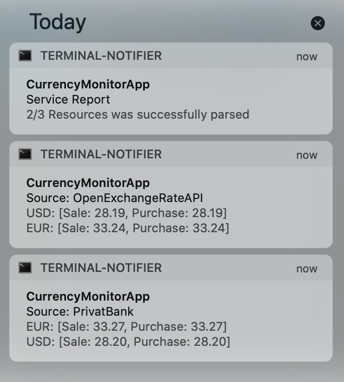

# Currency Monitor

## Description

This tool is created to monitor currency rates from different sources. It requests rates, parses response and 
converts rates to "UAH" base, then put result into MongoDB and do notification in OS (Only notification for Mac OS X+ works now).

## Getting started

### Local run

If you would like to run this script locally, you need to set up notification tool for your OS.

- Mac OS - [terminal-notifier](https://github.com/julienXX/terminal-notifier)

Set up:

``$ brew install terminal-notifier``

Notification example:


 
 - Windows - **have not done yet**
 - Linux - **have not done yet**

**How to run:**

First of all you need to install all script dependencies by executing command:

`pip3 install -r requirements`

Script help:
`python3 main.py --help `
```
usage: main.py [-h] [--config_path CONFIG_PATH]

Extracts currency exchange rate from different sources

optional arguments:
  -h, --help            show this help message and exit
  --config_path CONFIG_PATH
                        Path to config file
```

You have two general options:
- Set up global variables and run. ` python3 main.py`

For it you need to set next ENV variables:
```
CURRENCY_API_KEY=youAPIKey
MONGO_DB_ADDR=mongoDBName
MONGO_DB_PORT=port
```


- Use config file. `python3 main.py config.yml`
 

### Run in Docker

You also could run this tool in Docker. For it you need to execute command:

`docker-compose up`

**NOTE**: you won't see notifications in docker run, however all data will be saved! 
The same situation is for *cron* as well, by scheduling it in cron you won't see notification. 
 